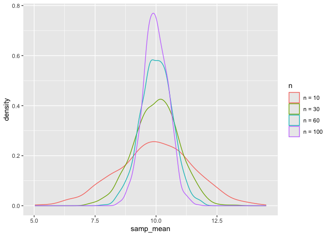
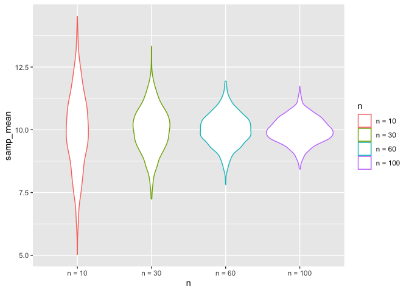
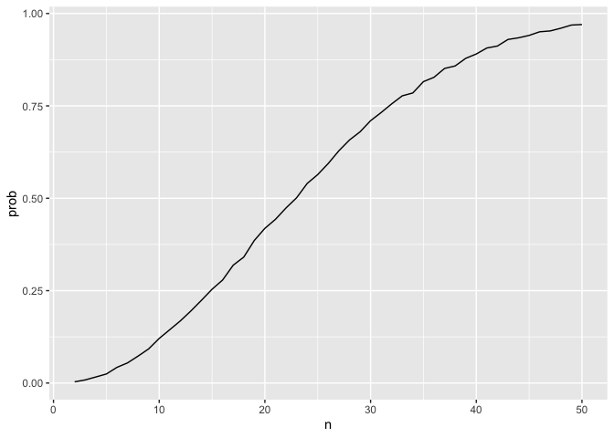

simulation
================
Ravi Brenner
2024-10-31

``` r
library(tidyverse)
set.seed(1)
```

wrote this function previously to get mean and SD from a normal
distribution

``` r
sim_mean_sd <- function(samp_size, true_mean = 10, true_sd = 5) {
  
  sim_data <- tibble(
    x = rnorm(samp_size, mean = true_mean, sd = true_sd)
  )
  
  sim_data |>
    summarize(
      samp_mean = mean(x),
      samp_sd = sd(x)
    )
}
```

Can run this a lot of times

``` r
output <- vector("list", 1000)

for (i in 1:1000) {
  output[[i]] <- sim_mean_sd(30)
}

bind_rows(output) |>
  summarize(avg_samp_mean = mean(samp_mean),
            SE_samp_mean = sd(samp_mean))
```

    ## # A tibble: 1 × 2
    ##   avg_samp_mean SE_samp_mean
    ##           <dbl>        <dbl>
    ## 1          9.99        0.870

Or can clean it all up into a dataframe

``` r
sim_results_df <- 
  tibble(iter = 1:1000,
         sample_size = 30) |>
  mutate(estimates = map(sample_size, sim_mean_sd)) |>
  unnest(estimates)
```

Can do different sample sizes

``` r
sim_results_df <- 
  expand_grid(
    n = c(10, 30, 60, 100),
    iter = 1:1000
  ) |>
  mutate(estimates = map(n, sim_mean_sd)) |>
  unnest(estimates)
```

``` r
sim_results_df |>
  group_by(n) |>
  summarize(
    se = sd(samp_mean)
  )
```

    ## # A tibble: 4 × 2
    ##       n    se
    ##   <dbl> <dbl>
    ## 1    10 1.56 
    ## 2    30 0.914
    ## 3    60 0.647
    ## 4   100 0.508

``` r
sim_results_df |>
  mutate(n = str_c("n = ", n),
         n = fct_inorder(n)) |>
  ggplot(aes(x = samp_mean, color = n)) +
  geom_density()
```

<!-- -->

``` r
sim_results_df |>
  mutate(n = str_c("n = ", n),
         n = fct_inorder(n)) |>
  ggplot(aes(x = n, y = samp_mean, color = n)) +
  geom_violin()
```

<!-- -->

## simple linear regression

``` r
sim_data <- 
  tibble(
    x = rnorm(30, mean = 1, sd = 1),
    y = 2 + 3 * x  + rnorm(30, mean = 0, sd = 1)
  ) 

lm_fit <- lm(y ~ x, data = sim_data)
lm_fit
```

    ## 
    ## Call:
    ## lm(formula = y ~ x, data = sim_data)
    ## 
    ## Coefficients:
    ## (Intercept)            x  
    ##       2.281        2.824

``` r
sim_data |>
  ggplot(aes(x = x, y = y)) + 
  geom_point() + 
  stat_smooth(method = "lm")
```

    ## `geom_smooth()` using formula = 'y ~ x'

<!-- -->

Turn this into a function

``` r
sim_regression <- function(n) {
  sim_data <-
    tibble(x = rnorm(n, mean = 1, sd = 1),
           y = 2 + 3 * x  + rnorm(n, mean = 0, sd = 1))
  
  lm_fit <- lm(y ~ x, data = sim_data)

  out_df <- tibble(
    beta0_hat = coef(lm_fit)[1],
    beta1_hat = coef(lm_fit)[2]
  )
  
  return(out_df)
}

sim_res <- 
  expand_grid(
    sample_size = c(30,60,120),
    iter = 1:1000
  ) |>
  mutate(lm_res = map(sample_size, sim_regression)) |>
  unnest(lm_res)

sim_res |>
  mutate(sample_size = str_c("n = ", sample_size),
         sample_size = fct_inorder(sample_size)) |>
  ggplot(aes(x = sample_size, y = beta1_hat)) +
  geom_violin()
```

<!-- -->

``` r
sim_res |>
  filter(sample_size == 30) |>
  ggplot(aes(x = beta0_hat, y = beta1_hat)) +
  geom_point()
```

<!-- -->

## ~ ~ ~ birthday problem ~ ~ ~

simulate the birthday problem (instead of solving it with math)

``` r
bday_sim <- function(n) {
  bdays <- sample(1:365, size = n, replace = TRUE)

  duplicate <- length(unique(bdays)) < n

  return(duplicate)
}

sim_res <-
  expand_grid(n = 2:50,
              iter = 1:10000) |>
  mutate(res = map_lgl(n, bday_sim)) |>
  group_by(n) |>
  summarize(prob = mean(res))

sim_res |>
  ggplot(aes(x = n, y = prob)) +
  geom_line()
```

<!-- -->
